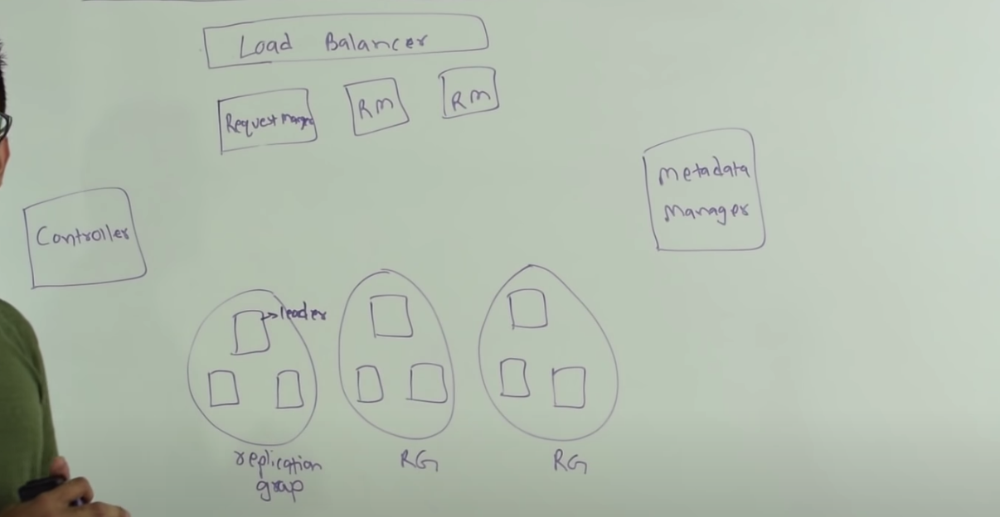
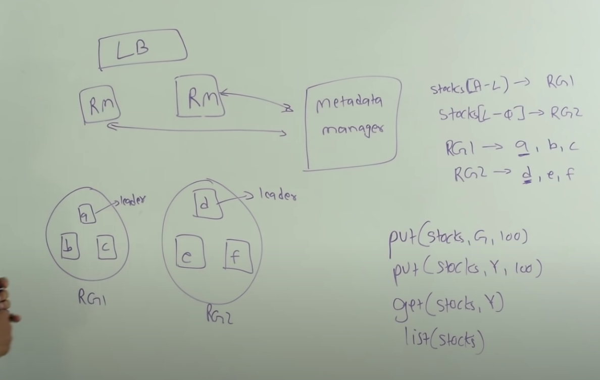
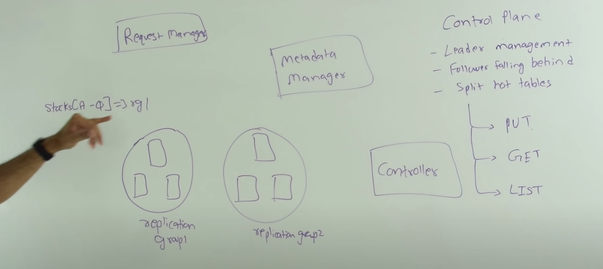
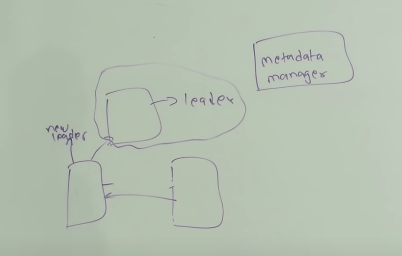
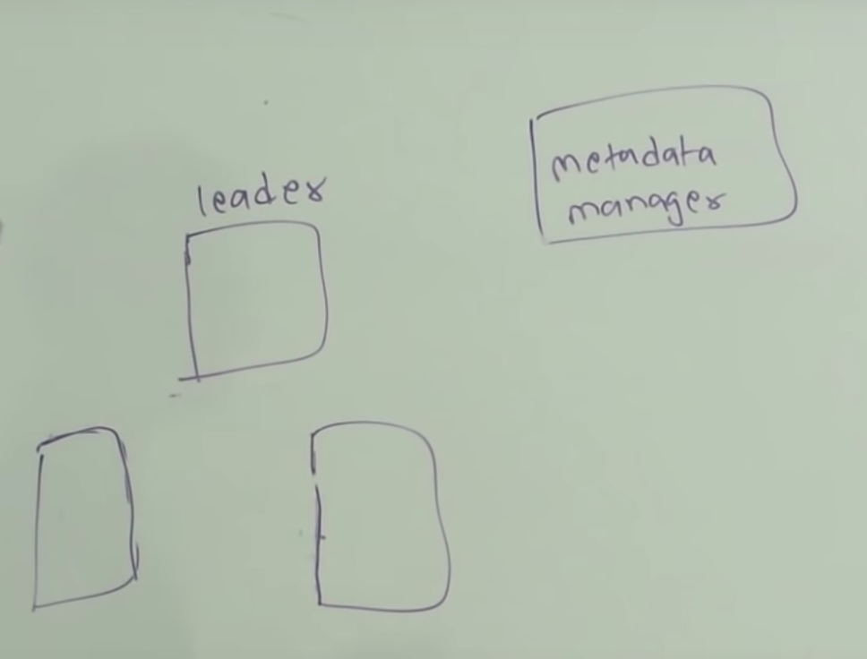
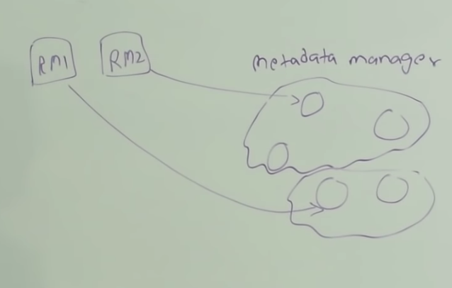

# Functional Requirements
- Durability
- Availability
- Performance
- Highly consistent 
- NO ACID
# Operations
- create table
- put (table, key, value)
- get(table, key)
- delete(table, key)
- delete(table)
# Sequencer
- increasing and unique number
- timestamp nano second (8 bytes) + unique per node (4 byte) + node id (4 byte) = 16 bytes
# create table
Stocks table
```
Name    Price   Seq
A       120     2
B       100     1
C       135     3
```
How to manage write without lock?
- put(Stocks, D, 140)
- put(Stocks, D, 160)
Reconciler process will pickup the highest sequencer id
# Database design

# Metadata Manager
- Leader election in replication group
- mapping of table part - replication group
- To store data for metadata manager, following are few options
    - zookeepr
    - etcd
    - redis
- Consensus algo
    - Paxos
    - Raft
- Data is not always consistent because of network split, so we will have more protection
- Keep all this data in memory of request manager
- Very critical data, needs to backup as frequently as possible
# Replication group
- Usually odd number for quoram
- LEader is selected
- Every write goes through leader for highly consistent write
Following are things part of replication
- append only log
- B+ tree or LSM tree for indexes
- Read heavy uses B+ tree and write heavy uses LSM tree

# Control plane
- Leader management
- when a new replication group come, all the three node will try to become leader, metadata manager will be elect one leader
- All nodes in replication group constantly heartbeat the metadata manager, thow's how metadata manager knows that replica is alive
- If any reason leader stop heartbeating to metadata manager, then new leader will be elected
- When follower starts falling behind the leader
    - monitor all application group
    - if one of the replica is malfunction and not responding
    - it replace that replica from pool of available nodes
    - Make sure new node is replicated from leader
- Split of hot tables
    - Hot table is table which grow with big size or high i/o ops
    - first it finds the replication group which can handle splitted table
    - If no available replication group exitst then get it from new pools
    - Update shard key mapping
    - During chunk migration, read will be dual read
    - During chunk migration, 

# split brain i.e. two leaders in replica group
- New leader talks to majority of replicas to accept new leader
- IF old leader receives write, then old leader will try to talk to majority for consistent write, but it will be rejected as majority will reject old leader write request

# No leader
- This is availability problem
- We can make more aggresive heartbeat i.e. instead of 1sec to 500 ms
- metadata manager does deep health check for nodes

# Network split on metadata manager

# Node goes down before updating B+ tree or LSM Tree
- We can replay from append only log
# Bad request manager
- Replication request will reject bad request manager
# Bad replicaiton node 
- If majority is good then it will work 
# multiple node failure 
- It is availability problem
- If loose all then it will be durability problem
- deep check by controller to make sure nodes are healthy
# Scale
- Every replication group can handle 5TB of data
- There will be 5 disks of 1TB each
- If you run 1000 replication group then you will get 5PB
- Limit on key/value 1MB
- Overhead per key/value = 30 bytes
- I/O = 200 rps per replication group
- Metadata overhead per replica group: 30 bytes
- Metadata overhead per table: 30 bytes
- RAM on request manager: 16BG 
- RAM on metadata manager: 4BG
 
